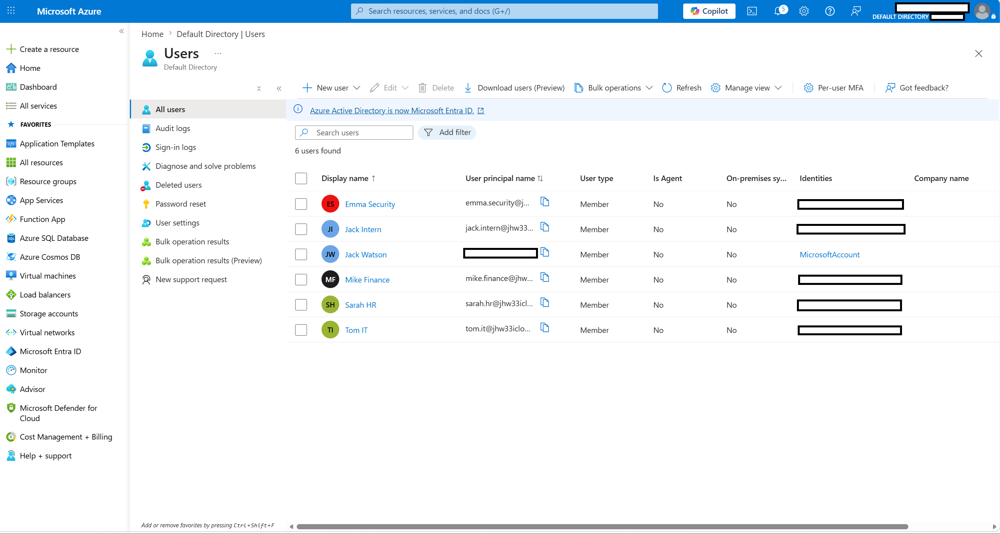
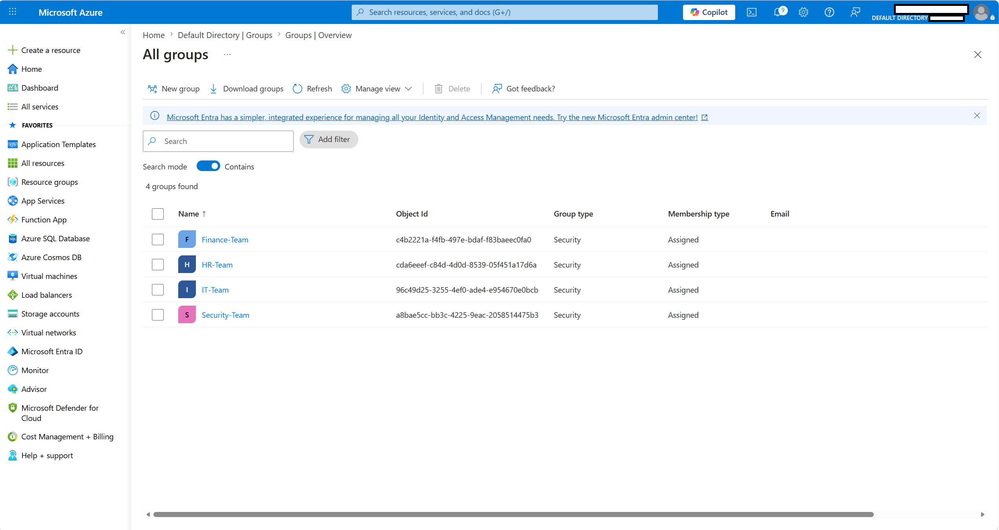
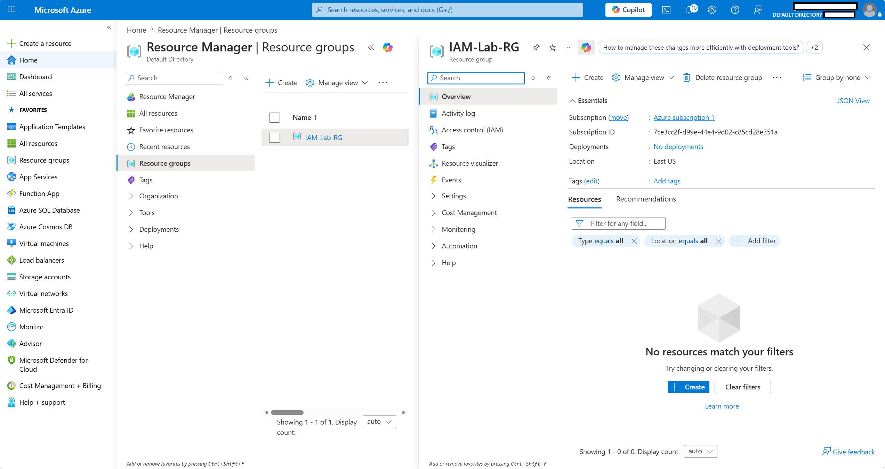
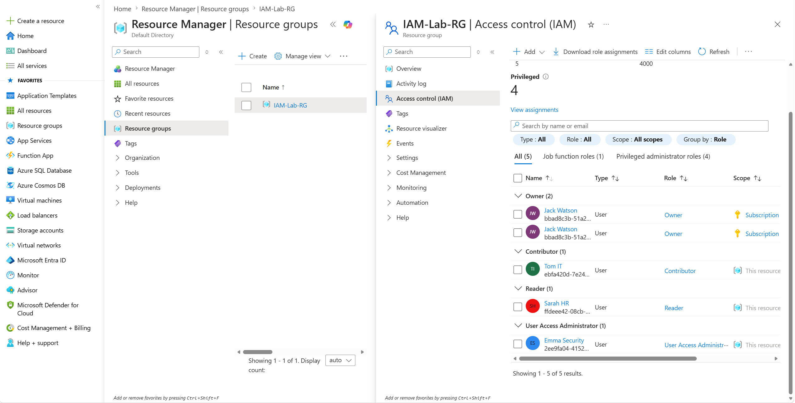
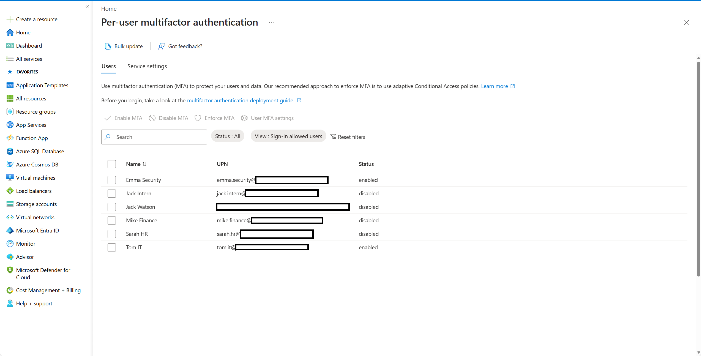
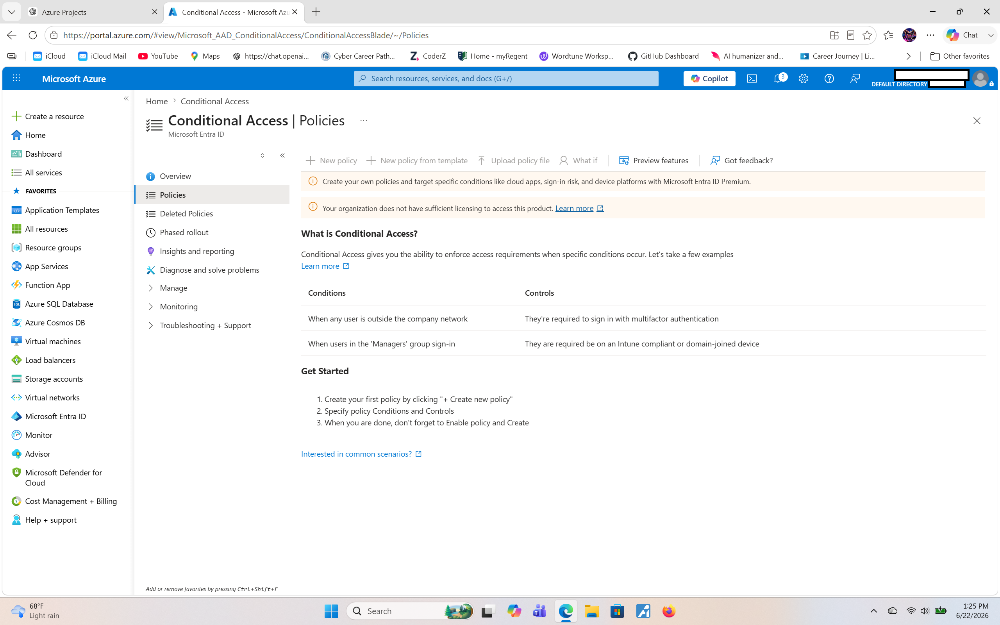

# Azure IAM Security Lab

## Overview

My project demonstrates identity and access management (IAM) concepts within Microsoft Azure using Microsoft Entra ID. The lab focuses on user administration, group management, role-based access control (RBAC), and multi-factor authentication (MFA) to simulate how organizations secure access to cloud resources.

## Objectives

- Create and manage users in Microsoft Entra ID
- Create security groups and assign users
- Implement Role-Based Access Control (RBAC)
- Apply least-privilege access principles
- Configure Multi-Factor Authentication (MFA)
- Research Conditional Access policies and licensing requirements

## Environment

- Microsoft Azure
- Microsoft Entra ID
- Azure Resource Groups
- Azure RBAC

## Architecture

Users
↓
Groups
↓
RBAC Roles
↓
Azure Resources

## Users Created

- Sarah HR
- Mike Finance
- Tom IT
- Emma Security
- Jack Intern

## Groups Created

- HR-Team
- Finance-Team
- IT-Team
- Security-Team

## RBAC Assignments

| User | Role |
|--------|--------|
| Tom IT | Contributor |
| Emma Security | User Access Adminstrator |
| Sarah HR | Reader |

## Security Concepts Demonstrated

### Least Privilege
Users were assigned only the permissions necessary to perform their responsibilities.

### Role-Based Access Control (RBAC)
Permissions were assigned through Azure roles to control access to resources.

### Multi-Factor Authentication (MFA)
MFA was enabled to provide an additional layer of account security.

### Conditional Access
Conditional Access was researched during the project. Configuration was unavailable because Microsoft Entra ID Premium licensing is required.

## Key Skills Demonstrated

- Microsoft Azure
- Microsoft Entra ID
- Identity and Access Management (IAM)
- Role-Based Access Control (RBAC)
- Multi-Factor Authentication (MFA)
- Cloud Security Fundamentals

## Project Screenshots

### Users

### Groups

### Resource Group

### RBAC Assignments

### MFA Configuration

### Conditional Access Licensing Requirement

